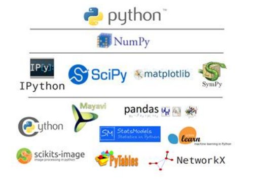
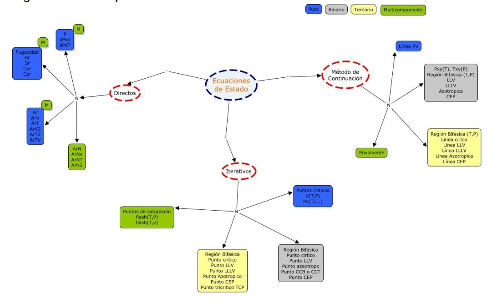

2. PyTher: an Open Source Python library for Thermodynamics
***********************************************************
***********************************************************
Some text, *italic text*, **bold text**
 
2.1 Abstract
------------

PyTher se desarrolla utilizando el framework de entorno interactivo IPython notebook para el analisis de problemas en termodinámica del equilibrio de fases permitiendo el acceso a su código para el diseño de algoritmos, su implementación, modificación y ampliación de funcionalidades por parte de usuarios avanzados siguiendo la filosofía open source and open science.

**PyTher** se enmarca en la tesis con título:

*Desarrollo de una librería open source para el cálculo de propiedades termodinámicas,equilibrios y diagramas de fases en base a ecuaciones de estado, para sustancias puras, sistemas binarios y mezclas multicomponente*

2.1.1 Objetivo General

Desarrollar una librería open source basada en la plataforma Jupyter y lenguaje Python, para el cálculo de propiedades termodinámicas, equilibrios y diagramas de fases, para sustancias puras, sistemas binarios y mezclas multicomponente.

**Keywords**
Thermodynamics; equation of state; open source; IPython notebook

2.2 Introduction.
-----------------

En la actualidad en la sociedad de la información se cuenta con acceso a una gran cantidad de datos que requieren ser procesados para obtener conocimiento de los mismos. En la investigación científica con el aumento de la capacidad y acceso a procesadores de computo más capaces se ha integrado a las metodologías tradicionales de investigación del trabajo experimental y teórico, la rama de la computación científica como una tercera componente que toma características de éstas dos, debido principalmente a la capacidad de realizar trabajo de experimentación numérica de acuerdo a diferentes modelos teóricos. De esta forma, en la ciencia actual se requiere del uso del cálculo científico en diferentes áreas de la ciencia y tecnología, principalmente para llevar a cabo experimentación numérica de teorías, además del moldeamiento y simulación diferentes fenómenos y sistemas para su posterior optimización.

Para realizar cálculos científicos no soló se requiere el entendimiento de las teorías bajo las cuales se desarrollan los modelos y ecuaciones que analizan fenómenos de diferentes áreas de las ciencias, también es necesaria la capacidad de implementar éstos modelos en un lenguaje de programación para acceder eficientemente al computo y solución de miles de ecuaciones. Hace varias décadas se han desarrollado lenguajes de programación especializados en el cálculo científico, destacandose C, C++ y FORTRAN, que siguen siendo empleados por científicos pero al mismo tiempo van reemplazandoce por lenguajes de programación modernos con mayores características, resaltando el lenguaje de programación Python, como un lenguaje de programación libre, multiplataforma, interpretado y multiparadigma que es poderoso y simple de aprender, además permite la implementación de estructuras de datos de forma simple, eficiente, moderna y elegante con su especial enfoque de programación orientado a objetos y una sintaxis simple con un tipado dinámico que facilita el mantenimiento del código, que cuenta con múltiples desarrollos especializados en el cálculo científico (Pérez & Granger, 2007) [#]_ (Perez, 2015) [#]_.

Figura 1. Ecosistema científico de Python

De esta forma, tradicionalmente dentro de la metodología de una investigación científica se ha tenido especial atención a los equipos (Hardware) y métodos que se han empleado durante la labor científica, dejando en un segundo plano el software-librería que ya tiene un lugar importante en el mundo científico por medio de herramientas como Excel, Chemdraw, Matlab y lenguajes de programación como Python, R y SQL, por nombrar algunos. Por tal motivo, importantes referencias de la comunidad científica han comenzado a dar espacios especializados para la divulgación del software-librería científico como lo es la sección Nature-Toolbox de la revista Nature que comenzó a ser publicada en septiembre de 2014 (Nature Editorial, 2014) [#]_. En Nature-Toolbox se ha presentado casos como el de Caladis.org, el cual es un proyecto open source desarrollado por los matemáticos Lain Jhonston y Nick Jones del Imperial College London que por medio de su librería Caladis online facilitan diferentes cálculos científicos de modelos estadísticos en biología (Van Noorden, 2015) [#]_. 

Dentro de los articulos de Nature-Toolbox, la plataforma IPython recibe atención especial pues es tiene las ventajas del lenguaje Python además de permitir el tipado y ejecución del código online por uno o varios usuarios con la posibilidad de combinar codigo Python con procesadores de textos como Latex, imágenes, vídeos y soportar HTML (Helen Shen, 2014) [#]_. IPyhon ya está presente en artículos científicos con sus notebook (Van Noorden. 2014; Tippmann 2014) [#]_, los cuales son empelados como una extensión dinámica e interactiva del artículo científico publicado permitiendo manipular el código de programación Python y reproducibilidad en tiempo real sin costo de tiempo de programación por parte de los lectores, haciendo más eficiente la comunicación de resultados de investigación. Para ver una lista más extensa de publicaciones científicas con IPython notebook puede consultar el repositorio en GitHub (Fernando Perez, 2015) [#]_.    

Por tanto, se plantea desarrollar una librería open sourse en lenguaje Python usando la plataforma IPython para calcular el comportamiento termodinámico de fases de hidrocarburos usando ecuaciones de estado Soave Redlich Kwong (SKR), Peng Robinson (PR) y (RKPR), basándose en los algoritmos y software (GPEC, FLUIDS) desarrollado por el grupo IDTQ (Cismondi and Mollerup, 2005) [#]_. Dando como resultados dos aportes principales, por un lado el desarrollo de software científico especializado en termodinámica de hidrocarburos con características que no se han encontrado en la revisión de la literatura especializada que se ha hecho y la incursión en el campo de la publicación científica con la moderna tecnología de IPython notebook. 

2.3 Actividades y Metodología
-----------------------------

La primera fase del trabajo consistirá en el desarrollo de los denominados cálculos directos mostrados en la figura 2. Los cálculos directos se basan en la implementación de la metodología modular (Cismondí et al. 2007) [#]_, para el cálculo de la función de la energía de Helmholtz, propiedades termodinámicas (presión, entalpía, entropía) y la fugacidad para sustancias puras y mezclas multicomponente usando las ecuaciones cubicas de estado SRK, PR y RKPR. 

La segunda fase del trabajo corresponde a los denominados cálculos iterativos, que tienen como base la implementación de la primera fase, puesto que se requiere del cálculo de la fugacidad y propiedades termodinámicas como parte de los algoritmos para resolver los sistemas de ecuaciones planteados de acuerdo a las especificaciones de cada sistema siguiendo la regla de las fases de gibbs. En esta fase, se implementarán métodos de cálculo para puntos críticos, propiedades volumétricas, puntos azeotrópicos, regiones bifásicas, cálculo de distribución de componentes en condiciones especificadas como los flash(T,P) y flash(T,v), entre otros que se muestran en la figura 2. 

Para la tercera fase se utilizará un método de continuación presentado por (Cismondí et al., 2008) [#]_, para trazar líneas PV, líneas de región bifásica, azeotrópica, critica, entre otras, resaltando la importancia de estas, para el entendimiento de los diagramas globales de equilibrio de fases. También se realiza una revisión de la literatura especializada en el diseño de software, puesto que este trabajo es interdisciplinar basado en el concepto de desarrollo de software evolutivo adaptado (Sommerville and Ian, 2004) [#]_, en el cual luego de realizar un desarrollo del software inicial, se expone a un panel de
usuarios, para ir refinando el software en versiones preliminares (versiones beta) hasta lograr una versión del software que cumpla con los requerimientos planteados.

Figura 2. Plan simplificado de la tesis doctoral.

Este trabajo se apoya en el amplio conocimiento que tiene el grupo de investigación dirigido por el Dr. Martín Cismondí, en el desarrollo e implementación de algoritmos de métodos numéricos en lenguajes de programación (principalmente Python) para simular el comportamiento de fases de fluidos supercríticos (Cismondi et al, 2007; Rodríguez et al, 2011 [#]_; Cismondi et al, 2008) [#]_ incluyendo sistemas que involucran precipitación de sólidos (Rodríguez et al, 2011).

Dentro de los principales métodos numéricos que se consideran para el desarrollo de este trabajo, se encuentran los métodos de continuación por homotopía (Allgower and Georg, 1990) [#]_, para solucionar los sistemas de ecuaciones altamente no lineales y sensibles a los estimados iniciales de las variables del modelo matemático, además de utilizar el concepto de homotopía termodinámica para automatizar la solución del modelo desde condiciones de baja presión y temperatura hasta la solución del modelo en condiciones supercríticas, lo cual reduciría el esfuerzo y tiempo de computo requerido (Pisoni, 2014) [#]_.

2.3. Referencias.
-----------------

.. [#] Pérez, F., Granger, B.E.: IPython: a System for Interactive Scientific Computing. Computing in Science and Engineering 9(3) (May 2007) 21–29

.. [#] Fernando Perez. (1 de Abril de 2015) A gallary of interesting Ipython Notebooks. GitHub IPython. Web: https://github.com/ipython/ipython/wiki/A-gallery-of-interesting-IPython-Notebooks#reproducible-academic-publications

.. [#] Helen Shen. Interactive notebooks: Sharing the code. Nature. Toolbox. 5 Noviembre 2014. ISSN: 0028-0836 

.. [#] Richard Van Noorden. My digital toolbox: Ecologist Ethan White on interactive notebook. Nature. Toolbox. 30 de Septiembre 2014.

.. [#] Richard Van noorden. My digial toolbox Back of the envelope biology. 20 Marzo 2015. Nature-Toolbox. doi:10.1038/nature.2015.17140

.. [#] Sylvia tippmann. My digital toolbox: Nuclear engineer Katy huff on version-control systems.Nature. Toolbox. 29 de Septiembre 2014. doi:10.1038/nature.2014.16014

.. [#] Nature Editorial. The digital toolbox. Nature 513, 6 (04 September 2014) doi:10.1038/513006b

.. [#] Cismondi, M. And Mollerup, J., Development and application of the three-parameter RK-PR equiation of state, Fluid Phase Equilibria, 232 (2005) 74-89.

.. [#] Cismondi , M., Michelsen, M.L., Global phase equilibrium calculations: Criticallines, critical end points and liquid-liquid-vapour equilibrium in binary mixtures, J.Supercrit. Fluids. 39 (2007) 287–295

.. [#] Cismondi , M., Michelsen, M.L., Zabaloy, M.S., AUTOMATED GENERATION OF PHASE DIAGRAMS FOR SUPERCRITICAL FLUIDS FROM EQUATIONS OF STATE, 11th Eur. Meet.Supercrit.Fluids. (2008).

.. [#] Sommerville, Ian (2004) Software Enginnering, 7th edition, Pretince Hall Traducción al español por el Departamento de Ciencias de la Computación e Inteligencia Artificial de la Universidad de Alicante (2005).

.. [#] Rodriguez-Reartes S.B., Cismondi M., Zabaloy M.S., Computation of solid-fluidfluid equilibria for binary asymmetric mixtures in wide ranges of conditions, J. Supercrit. Fluids. 57 (2011) 9–24.

.. [#] Rodriguez-Reartes S.B., Cismondi M., Zabaloy M.S., Modeling approach for the high pressure solid-fluid equilibrium of asymmetric systems, Ind. Eng. Chem. Res. 50 (2011) 3049–3059.

.. [#]  Allgower, E. L. and Georg, K. Introduction to numerical continuation methods. USA: Colorado StateUniversity/Springer, 1990. 388 p.

.. [#] Pisoni, G., Cismondi, M., Cardozo-Filho, L., Zabaloy, M.S. Generation of characteristic maps of the fluid phase behavior of ternary systems. Fluid Phase Equilibria 362 (2014) 213–226

