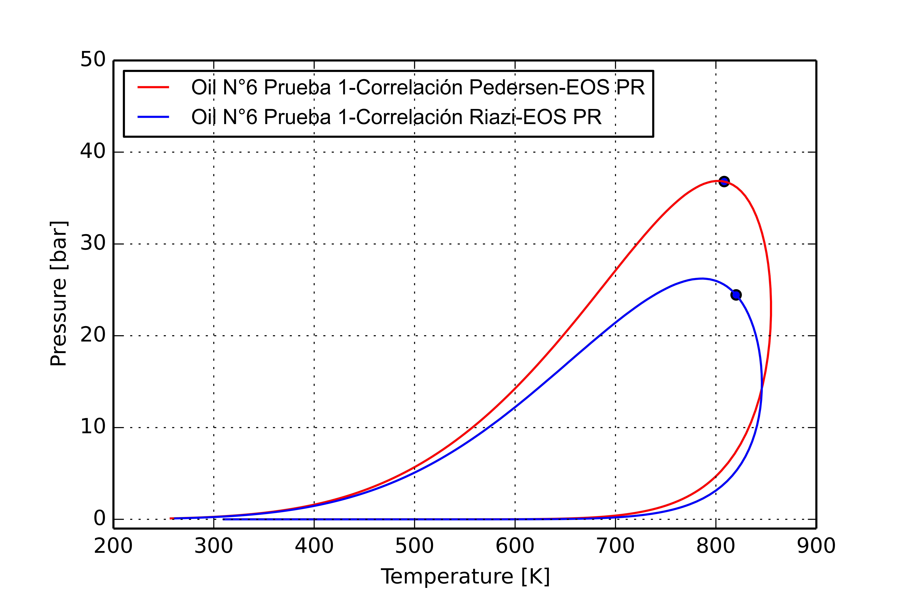
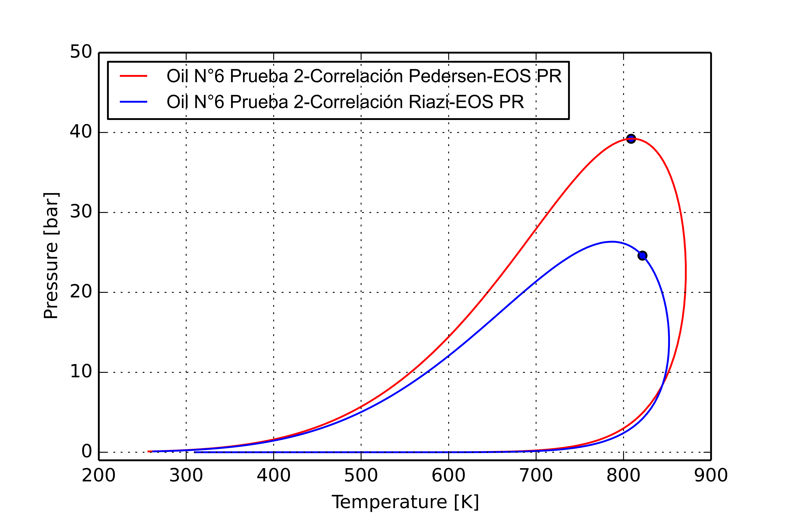
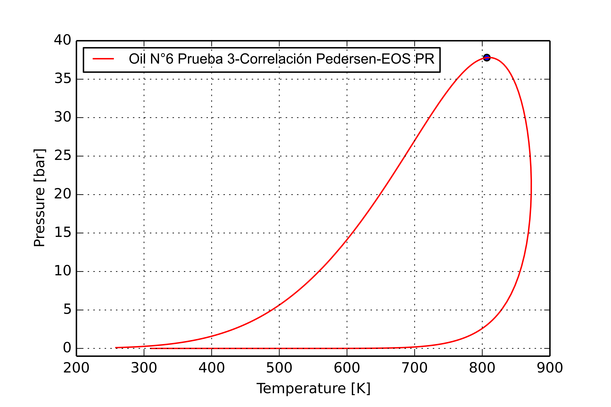
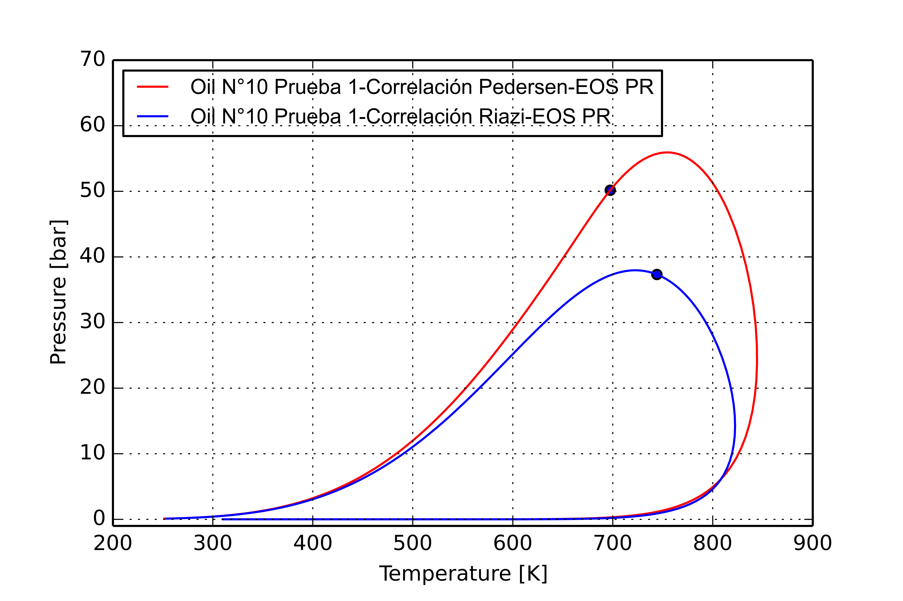
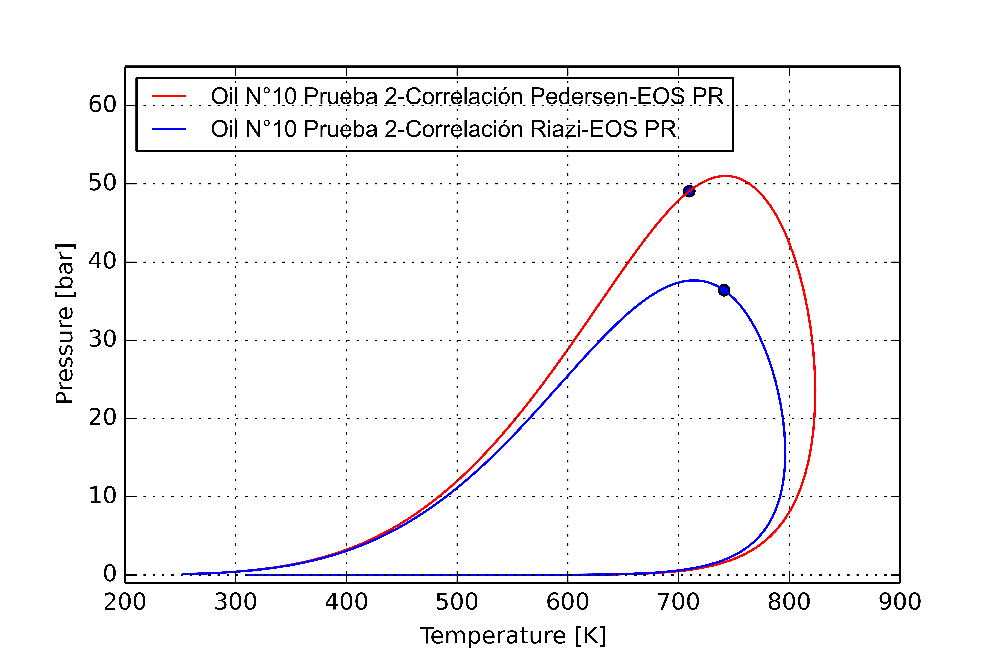
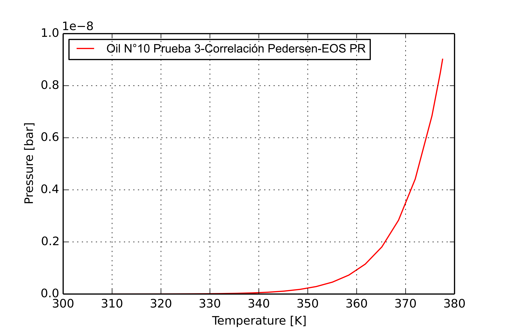
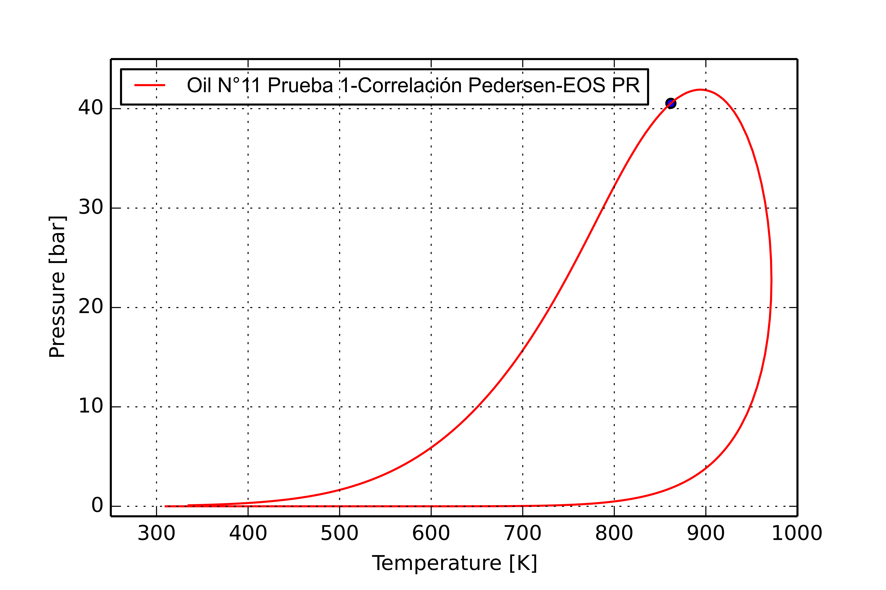

Curso de Termodinámica de Fluidos para la Industria Petrolera
*********************************************************************
*********************************************************************

1. Caracterización de Fracciones Pesadas de Fluidos de Reservorio
---------------------------------------
---------------------------------------

La simulación del comportamiento de fases y propiedades termodinámicas de fluidos juega un
rol muy importante en las industrias petrolera y petroquímica, entre otras, en diversas actividades
como la estimación de fluidos de yacimiento, definición de estrategias de producción,
dimensionamiento de instalaciones, diseño y optimización de equipos de separación, ductos, etc. Los
enfoques modernos de simulación utilizan, desde hace décadas, modelos basados en ecuaciones de
estado. Estos, a diferencia de otras alternativas, permiten un modelado continuo y consistente de
todos los tipos de fases fluidas, e incluso de la formación de fases sólidas si se complementan con un
modelo de fugacidades para este tipo de fases. Para lograr capacidad tanto correlativa como también
predictiva en amplios rangos de condiciones es necesario no sólo seleccionar una ecuación de estado
y reglas de mezclado apropiadas para el tipo de sistema, si no también implementar una cuidadosa 
estrategia de parametrizado de las interacciones.
Un problema de singular importancia en el modelado de fluidos reales de reservorio, a diferencia de los
fluidos sintéticos cuya composición es totalmente conocida, es la caracterización de fracciones
pesadas. Es decir, cómo descomponer o de qué manera considerar a los distintos 
cortes de destilación y la fracción residual más pesada, que contienen un elevado número de compuestos
pesados indefinidos de distinto tipo: parafínicos, nafténicos, aromáticos y otros. 
El principio de distintos enfoques tradicionales, y la vez lo natural para el uso de ecuaciones de
estado, consiste en descomponer a las fracciones pesadas en un determinado número de pseudo-componentes
y agrupar luego a los mismos con el fin de acotar tanto la magnitud del sistema como los tiempos de 
cómputo asociados en una simulación, pero sin deteriorar la descripción del comportamiento PVT del 
fluido frente a cambios de composición, presión y temperatura.

1.1. Objetivos a alcanzar en el presente trabajo:
---------------------------------------
--------------------------------------- 

1. Seleccionar 3 fluidos reales y descomponer la fracción pesada como un número finito de 
pseudo-componentes.
2. Calcular las envolventes de fase para el sistema.
3. Realizar los cálculos flash de cada sistema (para los tres fluidos).
4. Utilizar distintas correlaciones para conocer las propiedades críticas y factor acéntrico, 
comparar los resultados. 
5. Obtener conclusiones.

1.2. Forma de Trabajo
---------------------------------------
--------------------------------------- 

Para este trabajo se utilizaron 3 fluidos de la base de datos de Pedersen (Pedersen et al, 1992) [#]_, 
que se denominan OIL 6, OIL 10 y OIL 11. Para cada fluido se descompuso la fraccion C20+ en 3, 5 y 10 
pseudo-componentes con igual valor de fracción molar. Para conocer las propiedades críticas de los 
pseudo-componentes se utilizaron las correlaciones de Pedersen [#]_ :

.. note::
    La Presión se simbolizará con P, Temperatura con T, fracción molar con z y factor acéntrico.
    Al mencionar los parámetros críticos se agrega un subíndice "c".

.. math::  
	
	
	T_{c} = c_{1} \rho + c_{2} ln(PM) + c_{3} PM + \frac {c_{4}}{PM}
   
	ln(P_{c}) = d_{1} + d_{2} \rho^d_{5} + \frac {d_{3}}{PM} + \frac {d_{4}}{PM^2}	
	
	m = e_{1} + e_{2} PM + e_{3} \rho + e_{4} PM^2
   
	m= f_{1} + f_{2} \omega + f_{3} \omega^2

Tabla 1. Coeficientes para correlación de Pedersen:
	
+-----------------------+-----------------+-----------------+-----------------+------------------+------------------+
|Subíndices/Coeficientes|        1        |        2        |        3        |        4         |        5         |
+-----------------------+-----------------+-----------------+-----------------+------------------+------------------+
|           c           |     73.4043     |     97.3562     |    0.618744     |    −2059.32      |        −         |
+-----------------------+-----------------+-----------------+-----------------+------------------+------------------+ 
|           d           |    0.0728462    |     2.18811     |     163.910     |    −4043.23      |       0.25       |
+-----------------------+-----------------+-----------------+-----------------+------------------+------------------+
|           e           |     0.373765    |    0.00549269   |    0.0117934    |  −0.0000043049   |        −         |
+-----------------------+-----------------+-----------------+-----------------+------------------+------------------+
|           f           |     0.37464     |     1.54226     |    −0.26992     |         −        |        −         |
+-----------------------+-----------------+-----------------+-----------------+------------------+------------------+
    
Y las de Riazi- Daubert [#]_:

.. math:: \Theta = a PM^b \rho^c exp (d PM + e \rho + f PM \rho ))

En la siguiente tabla se muestra el valor de las constantes a, b, c, d, e, f, para cada propiedad.

Tabla 2. Coeficientes para correlación de Pedersen:

+------------------------+-----------------+-----------------+-----------------+------------------+------------------+------------------+
|Propiedad / Coeficientes|        a        |        b        |        c        |        d         |        e         |        f         |
+------------------------+-----------------+-----------------+-----------------+------------------+------------------+------------------+
|           Tc [ºR]      |      544.4      |      0.2998     |     1.0555      |   −0.00013478    |     −0.61641     |         −        |
+------------------------+-----------------+-----------------+-----------------+------------------+------------------+------------------+
|           Tb [ºR]      |     6.77857     |     0.401673    |    −1.58262     |    0.00377409    |     2.984036     |    −0.00425288   |
+------------------------+-----------------+-----------------+-----------------+------------------+------------------+------------------+
|           Pc [psia]    |      45203      |     −0.8063     |      1.6015     |    −0.0018078    |     −0.3084      |         −        |
+------------------------+-----------------+-----------------+-----------------+------------------+------------------+------------------+
   
Para el cálculo del factor acéntrico se utiliza la correlación de Edmister [#]_:

.. math:: \omega = \frac {3[log(\frac{P_{c}}{1.013565})]}{7[(\frac {T_{c}}{T_{b}})-1]} - 1
 
Cabe destacar que las unidades para las correlaciones de Pedersen son K para las temperaturas cricas,
bar para presión crítica; y tanto para los cálculos flash, como para las envolventes de fase, se 
utilizaron estas unidades. Para dichos cálculos se utilizó la libreria de Python SUR. 

1.3. Resultados
---------------------------------------
--------------------------------------- 

     Figura 1. Prueba con tres pseudocomponentes para el fluido "Oil 6"
              

     Figura 2. Prueba con cinco pseudocomponentes para el fluido "Oil 6"

     Figura 3. Prueba con diez pseudocomponentes para el fluido "Oil 6"

     Figura 4. Prueba con tres pseudocomponentes para el fluido "Oil 10"

     Figura 5. Prueba con cinco pseudocomponentes para el fluido "Oil 10"

     Figura 6. Prueba con diez pseudocomponentes para el fluido "Oil 10"

     Figura 7. Prueba con tres pseudocomponentes para el fluido "Oil 11"

     Figura 8. Prueba con cinco pseudocomponentes para el fluido "Oil 11"

La correlacion de Pedersen predice una mayor región de inmisicibilidad en comparaciónn a la correlación
de Riazi. Esto se puede apreciar, ya que la isopleta predicha por Pedersen abarca un área mayor.
Por ejemplo si me ubico a 45 bar y 750 K, la correlacion de Pedersen predice que habrá separacion de 
fases, mientras que Riazi predice una única fase homogenea.  
Otra observacion es la diferencia en la posicion del punto crítico, que implica que bajo ciertas 
condiciones de P y T si utilizamos una correlación, tendremos un líquido saturado y con la otra,
un vapor saturado para una dada isopleta. Dando un ejemplo, en la **Figura 5**, si me ubico en 60
bar y 720 K aproximadamente, al bajar la P para la isopleta correpsondiente a la correlación de Pedersen
obtengo un punto de rocío, mientras que para la correlación de Riazi, uno de burbuja.
Para el fluido "Oil 11" no se pudo utilizar la correlación de Riazi en ningún caso. En los otros fluidos
en el caso de 10 pseudocomponentes no fue posible usar dicha correlación.
  

2. Referencias
%%%%%%%%%%%%%%%%%%%%%%%%%%%%%%%%%%%%%%%
%%%%%%%%%%%%%%%%%%%%%%%%%%%%%%%%%%%%%%%

.. [#]	Pedersen, K. Blilie, L. Meisingset, K., "PVT Calculations on Petroleum Reservoir Fluids Using Measured and Estimated Compositional Data for the Plus Fraction", Industrial & Engineering Chemistry Research, 31 (1992) 1378-1384.

.. [#]  Pedersen, K. Christensen,P., "Phase behavior of petroleum reservoir fluids", Boca Raton, 2007, Taylor & Francis Group.

.. [#]	Riazi, M. R. and Daubert, T. E., "Characterization Parameters for Petroleum Fractions", Industrial & Engineering Chemistry Research, 26 (1987) 755-759.

.. [#]	Edmister, W. C., "Applied Hydrocarbon Thermodynamics, Part 4: Compressibility Factors and Equations of State", Petroleum Refiner, 37 (1958) 173-179. 
