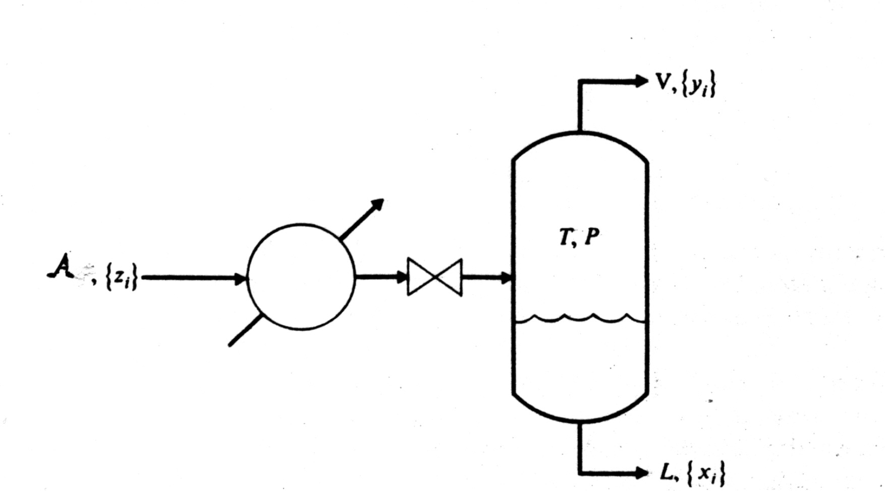

**************************************
7. Cálculo del flash Isotermico (T, P)
**************************************

En este documento se presenta el desarrollo básico del comportamiento termodinámico del equilibrio de fases, iniciando con el calculo del flash isotermico bifasico utilizando las ecuaciones de estado como **Soave-Redlich-Kwong (SRK)** [1]_ y **Peng-Robinsong (PR)** [1]_ junto con las reglas de mezclado de **Van Der Waalls** [1]_.

El cálculo del flash isotermico bifasico es un cálculo básico en la introducción de los procesos de separación porque es 
el esqeuma tecnologíco de separación más simple, el que se ingresa una corriente de fluido a un "tanque" calentado por un flujo de calor en el que se obtiene una corriente de salida por cada fase presente en el sistema. En el caso bifasico, una corriente de líquido y otra de vapor. 

.. note::
	En este capítulo se utiliza el enfoque de sustitución sucesiva para resolver la ecuación de Rachford-Rice [2]_, mientras que en capítulo 3 se presenta el enfoque simultaneo al resolver el sistema de ecuaciones por medio del método de Newton multivariado.

7.1 Modelo flash líquido-vapor
******************************

El modelo del flash isotermico bifasico, corresponde al balance de materia global y por componente en el tanque separador que se muestra en la figura (1), junto con la condición de equilibrio de fases líquido-vapor.

Figura 1. Esquema del calculo flash

Coeficiente de distribución :math:`K_i`

.. math:: Ki = \frac {yi} {xi}
	:label:

.. math:: g(\beta) = \sum \limits_{i=1}^{C} (y_i - x_i) 
	:label:

.. math:: g(\beta) = \sum \limits_{i=1}^{C} \frac {K_i - 1} {1 - \beta + \beta K_i}
	:label:

.. math:: dg^(\beta) = \sum \limits_{i=1}^{C} z_i \frac {(K_i - 1)^2} {(1 - \beta + \beta K_i)^2} < 0
	:label:

.. math:: g(0) = \sum \limits_{i=1}^{C} (z_i K_i - 1) > 0
	:label:

.. math:: g(1) = \sum \limits_{i=1}^{C} (1 - \frac {z_i} {K_i}) < 0
	:label:

.. math:: y_i \frac{K_i z_i} {1 - \beta + \beta K_i}
	:label:

.. math:: x_i = \frac{z_i} {1 - \beta + \beta K_i}
	:label:

Aproximación de wilson para el coeficiente de distribución :math:`K_i`

.. math:: lnK_i = ln \left(\frac {Pc_i} {P}\right ) + 5.373(1 + w_i)(1 - \frac {Tc_i} {T})
	:label:

.. math:: 1 - \beta + \beta K_i >= K_i z_i 
	:label:

.. math:: \beta >= \frac {K-i z_i - 1} {K_i - 1}
	:label:

.. math:: 1 - \beta + \beta K_i >= z_i 
	:label:

.. math:: \beta <= \frac {z_i - 1} {1 - K_i}
	:label:

Valores extremos de la fracción de vapor en el sistema :math:`\beta`

.. math:: \beta_{min} = 0
	:label:

.. math:: \beta_{max} = 1
	:label:

El incumplmiento de las condicones (13) y (14) corresponden a un líquido subenfriado :math:`\beta = 0` y un vapor sobrecalentado :math:`\beta = 1`

Determinar el valor de Beta minimo y máximo. Luego estimar el promedio de estos Beta para usarlo como valor inciial

7.2 Algoritmo
*************

- Especificar la Presión **P**, Temperatura **T** y número de moles **N** del sistema
- Especificar los componentes de la mezcla
- Calcular el coeficiente de distribución **Ki** a partir de la relación de Wilson
- Calcular el valor de **Beta minimo**
- Calcular el valor de **Beta máximo**
- Calcular el promedio de beta, usando Beta minimo y Beta máximo
- Resolver la ecuación de **Rachford-Rice**, para calcular Beta con una tolerancia de *1e-6*
- Calcular las fracciones molares del líquido **xi** y del vapor **yi**
- Calcular los coeficientes de fugacidad para las fracciones molares del líquido **xi** y del vapor **yi**
- Calcular el coeficiente de distribución **Ki** a partir de los coeficientes de fugacidad del componente i en la mezcla de la fase vapor y líquido
- Verificar la convergencia del sistema con una tolerancia de 1e-6 para deltaKi
- Calcular la funcion de la energía de Helmholtz F
- calcular el coeficiente de fugacidad del compoenete i en la mezcla de la fase líquida y fase vapor.

De esta forma el código es de la siguiente forma::

	class Flash():

    def __init__(self, zi_F, temperature_f, pressure_f, TcDato_f, PcDato_f, wDato_f):
        self.zi = zi_F
        self.T = temperature_f
        self.P = pressure_f
        self.Tc = TcDato_f
        self.Pc = PcDato_f
        self.w = wDato_f        
        
    def wilson(self):
        # Ecuación wilson
        lnKi = np.log(self.Pc / self.P) + 5.373 * (1 + self.w) * (1 - self.Tc / self.T)
        self.Ki = np.exp(lnKi)
        return self.Ki

    def beta(self):
        # Estimación de la fracción de fase de vapor en el sistema
        self.Ki = self.wilson()
        #Bmin = np.divide((self.Ki * self.zi - 1), (self.Ki - 1))
        Bmin = (self.Ki * self.zi - 1) / (self.Ki - 1)
        
        #print (("Bmin_inter = ", Bmin))
        
        Bmax = (1 - self.zi) / (1 - self.Ki)
        #print (("Bmax_inter = ", Bmax))
        self.Bini = (np.max(Bmin) + np.min(Bmax)) / 2
        print("inib =", self.Bini)
        return self.Bini

    def rice(self):
        # Ecuación de Rachford-Rice para el equilibrio líqudo-vapor
        self.fg = np.sum(self.zi * (self.Ki - 1) / (1 - self.Bini + self.Bini * self.Ki))
        self.dfg = - np.sum(self.zi * (self.Ki - 1) ** 2 / (1 - self.Bini + self.Bini * self.Ki) ** 2)
        #print g, dg
        return self.fg, self.dfg
    
    def composicion_xy(self):
        # Ecuación de Rachford-Rice para calcular la composición del equilibrio líqudo-vapor
        self.xi = self.zi / (1 - self.Bini + self.Bini * self.Ki)
        self.yi = (self.zi * self.Ki) / (1 - self.Bini + self.Bini * self.Ki)
        self.li = (self.zi * (1 - self.Bini)) / (1 - self.Bini + self.Bini * self.Ki)
        self.vi = (self.zi * self.Bini * self.Ki) / (1 - self.Bini + self.Bini * self.Ki)

        return self.xi, self.yi, self.li, self.vi

    def flash_ideal(self):
        # Solución del flash (T,P,ni) isotermico para Ki_(T,P)
        self.Bini = self.beta()
        self.Ki = self.wilson()
        # print ("Ki_(P, T) = ", self.Ki)
        Eg = self.rice()
        errorEq = abs(Eg[0])
        # Especificaciones del método Newton precario, mientras se cambia por una librería Scipy
        i, s, ep = 0, 1, 1e-5

        while errorEq > ep:
            Eg = self.rice()
            self.Bini = self.Bini - s * Eg[0] / Eg[1]
            errorEq = abs(Eg[0])
            i += 1
            if i >= 50:
                break

        xy = self.composicion_xy()        
        print ("-"*53, "\n", "-"*18, "Mole fraction", "-"*18, "\n","-"*53)
        print ("\n", "-"*13, "Zi phase composition", "-"*13, "\n")
        print ("{0} = {1} \n {2} = {3} \n {4}={5} \n {6}={7} \n".format(Componentes_f1.value, self.zi[0], Componentes_f2.value, self.zi[1], Componentes_f3.value, self.zi[2], Componentes_f4.value, self.zi[3]))
        print ("Sumatoria zi = {0}".format(np.sum(self.zi)))       
        print ("\n", "-"*13, "Liquid phase composition", "-"*13, "\n")
        print ("{0} = {1} \n {2} = {3} \n {4}={5} \n {6}={7} \n".format(Componentes_f1.value, self.xi[0], Componentes_f2.value, self.xi[1], Componentes_f3.value, self.xi[2], Componentes_f4.value, self.xi[3]))
        print ("Sumatoria xi = {0}".format(np.sum(self.xi)))
        print ("\n", "-"*14, "Vapor phase composition", "-"*13, "\n")
        print ("{0} = {1} \n {2} = {3} \n {4}={5} \n {6}={7} \n".format(Componentes_f1.value, self.yi[0], Componentes_f2.value, self.yi[1], Componentes_f3.value, self.yi[2], Componentes_f4.value, self.yi[3]))
        print ("Sumatoria yi = {0}".format(np.sum(self.yi)))
        print ("-"*53, "\n","Beta = {0}".format(self.Bini), "\n")
        print ("\n","Función R&R = {0}".format(Eg[0]), "\n")
        print ("\n","Derivada función R&R = {0}".format(Eg[1]), "\n", "-"*53)

        return #Eg[0], Eg[1], self.Bini
    
	class FlashHP(Fugacidad, Flash):

    	def __init__(self, zF):
        	Fugacidad.__init__(self, eq, w, Tc, Pc, Tr, R, ep, ni, nT, nC, V, T, P, kij, lij, delta_1, k, Avsl)
        	self.zF = zF
        
      
    
    	def flash_PT(self):
        	# Solución del flash (T,P,ni) isotermico para Ki_(T,P,ni)
        	flashID = self.flash_ideal()
        	print ("flash (P, T, zi)")
        	print ("g, dg, B = ", flashID)
        	print ("-"*66)

        	self.Bini = flashID[2]
        	print ("Beta_r ini = ", self.Bini)
        	moles = self.composicion_xy()

        	self.xi, self.yi = moles[0], moles[1]
        	nil, niv = moles[2], moles[3]

        	fi_F = self.fugac()        

        	self.Ki = fi_F[0] / fi_F[1]

        	L = 1.0

        	self.Ki = self.Ki * L

        	Ki_1 = self.Ki
        	print ("Ki_(P, T, ni) primera = ", self.Ki)

        	print ("-"*66)

        	#self.Ki = np.array([1.729, 0.832, 0.640])

        	#self.Ki = self.wilson(self.Pc, self.Tc, self.w, self.T)
        	#print "Ki_(P, T) = ", self.Ki

        	while 1:
            	i, s = 0, 0.1

            	while 1:
                	Eg = self.rice()
                	print (Eg)
                	self.Bini = self.Bini - s * Eg[0] / Eg[1]
                	print (self.Bini)
                	errorEq = abs(Eg[0])
                	i += 1
                	#print i

                	#if self. Bini < 0 or self.Bini > 1:
                    	#break
                	#    self.Bini = 0.5
                	if i >= 50:
                    	pass
                    	#break
                	if errorEq < 1e-5:
                    	break

            	print ("Resultado Real = ", Eg)
            	print (" Beta r = ", self.Bini)

            	moles = self.composicion_xy(zi, self.Ki, self.Bini)
            	self.xi, self.yi = moles[0], moles[1]

            	#xy = self.composicion_xy(zi, self.Ki, self.Bini)

            	print ("C1 -i-C4 n-C4")
            	print ("-"*13, "Composición de fase líquida", "-"*13)
            	print ("xi = ", moles[0])
            	print ("Sxi = ", np.sum(moles[0]))
            	print ("-"*13, "Composición de fase vapor", "-"*13)
            	print ("yi = ", moles[1])
            	print ("Syi = ", np.sum(moles[1]))

            	fi_F = self.fugac()

            	self.Ki = fi_F[0] / fi_F[1]
            	Ki_2 = self.Ki
            	dKi = abs(Ki_1 - Ki_2)
            	Ki_1 = Ki_2
            	print ("Ki_(P, T, ni) = ", self.Ki)

            	fun_Ki = np.sum(dKi)
            	print ("fun_Ki = ", fun_Ki)

            	if fun_Ki < 1e-5:
                	break

        	return flashID

7.3 Resultados
**************

A continuación se muestran los resultados numéricos del calculo del flash isotermico bifasico
para una mezcla de los componentes C2-C3-C4. En la tabla 1, se muestra las especificaciones de
la presión P, temperatura T y flujo F junto con las fracciones molares del líquido, del vapor 
y la fracción de fase resultanten usando como modelo termodinámico la ecuación de estado 
*Peng-robinson (PR)* y las reglas de mezclado de **Van Der Waalls**. 

Tabla.1 flash isotermico Ki(T, P) Mezcla ideal

+---------------+-----------------+-----------------+
|  Presión Bar  |  Temperatura K  |  Flujo F mol/h  |
+---------------+-----------------+-----------------+
|     8         |      320        |        1        |   
+---------------+-----------------+-----------------+
+------------+------------+------------+------------+
| Componente | Ingresa zi | líquido xi |  Vapor yi  |
+------------+------------+------------+------------+
|     C2     |    0.23    |0.18357118  |0.37209837  |
+------------+------------+------------+------------+
|     C3     |    0.67    |0.70479988  |0.56349276  |
+------------+------------+------------+------------+
|    C4      |    0.10    |0.11162895  |0.06440887  |
+------------+------------+------------+------------+
|      g     |     6.1017797856749434e-07           |
+------------+--------------------------------------+
|     dg     |     -0.20663315922997191             |
+------------+--------------------------------------+
|    Beta    |          0.24627123315157093         |
+------------+--------------------------------------+

Tabla.2 Flash isotermico Ki(T, P, nil, niv) **(PR)**

+---------------+-----------------+-----------------+
|  Presión Bar  |  Temperatura K  |  Flujo F mol/h  |
+---------------+-----------------+-----------------+
|     8         |      320        |        1        |
+---------------+-----------------+-----------------+
+------------+------------+------------+------------+
| Componente | Ingresa zi | líquido xi |  Vapor yi  |
+------------+------------+------------+------------+
|     C2     |    0.23    |0.20070242  |0.35071046  |
+------------+------------+------------+------------+
|     C3     |    0.67    |0.69183981  |0.5800167   |
+------------+------------+------------+------------+
|     C4     |    0.10    |0.10745949  |0.06926579  |
+------------+------------+------------+------------+
|      g     |     -9.7482523918959729e-06          |
+------------+--------------------------------------+
|     dg     |     -0.13108663002971882             |
+------------+--------------------------------------+
|    Beta    |          0.19530673657               |
+------------+--------------------------------------+

De esta forma, se observa que el algoritmo empleando la ecuación de estado **Peng-Robinson (PR)** converge en a una solución *cercana* de la solución que utiliza la aproximación de wilson para el coeficiente de distribución **Ki**, mostrando ser efieciente para casos simples como el presente en este capítulo.

.. note::
	1. Se require desarrollar ejemplos para más modelos termodinámicos. Implementados en el modulo de Fugacidad.

	2. Se requiere implementar más algoritmos de cálculo enfocados en el flash. Aceleración de convergencia y estrategias de resolución de ecuaciones no lineales.

	3. Se requiere implementar más posibilidades del calculo de flash: Multifase, Volumen constante, Adiabatico, entre otros.

7.4 Conclusiones
****************

1. Se implemento en el lenguaje de programación Python 3.x los algoritmos para el calculo de la fugacidad para un componente puro y una mezcla multicomponente siguiendo el enfoque modular de Mollerup-Michelsen para la energía libre de Helmhotlz F usando una ecuación de estado y el calculo del flash isotermico (T, P) multicomponente bifasico.

2. La documentación del trabajo se realizó usando el formato **reStructuredtext** y la librería **Sphinx**, el cual permite combinar eficientemente en un texto plano, código **latex**, código de programación en este caso **Python**, imagenes entre otros, para facilitar el proceso de documentación de un desarrollo de software.

7.5 Referencias
***************

.. [#] Curso de especialización en Termodinámica de fluidos para la industria Petrolera. Ph.D Martín Cismondí. Mayo (2015)

.. [#] Introductory Chemical engineering thermodynamics. J. Richard Elliott , Carl T. Lira. Prentice Hall (2012)  

