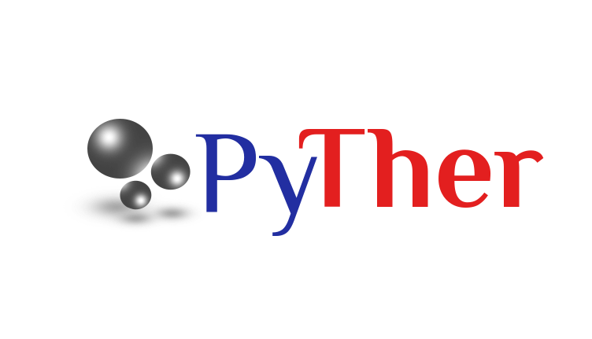

.. PyTher documentation master file, created by
   sphinx-quickstart on Sun Jun 14 02:20:23 2015.
   You can adapt this file completely to your liking, but it should at least
   contain the root `toctree` directive.

Documentación PyTher 0.6
==========================

**PyTher** (Python to Thermodynamics) es una biblioteca **open source** orientada a cálculos del comportamiento termodinámicos de fases.  

Contacto: andres.pyther@gmail.com

Última actualización 03/15/17.

Contents:

.. toctree::
   :maxdepth: 2
   
   instalacion_pyther.rst
   Jupyther_1.rst
   Diagrama_clase.rst   
   thermodynamic_correlations.rst
   pyther_reunion.rst
   Volumen.rst
   Hmz.rst
   IPyTherm_2.rst
   Envolvente.rst
   sistemas_binarios.rst
   Estabilidad.rst
   PuntosCriticos.rst
   mezclas_multicomponentes.rst   
   flash.rst
   modelos_energia_gibbs.rst
   pyther_consistencia.rst   
   Curso_Termodinamica.rst   

Indices and tables
==================

* :ref:`genindex`
* :ref:`modindex`
* :ref:`search`

