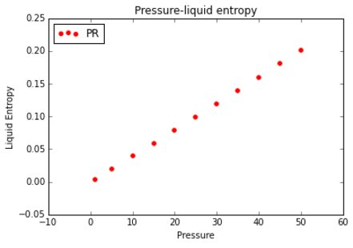

Objetivos a corto plazo
-----------------------
-----------------------

mnassetta@gmail.com

Avance 1, Lunes 28 de Marzo:

Obtención de las propiedades críticas de DIPPR

- Presión crítica
- Temperatura crítica
- Volumen critico

cálculo de parámetros de las EOS

- SRK
- PR
- RKPR

Diagramas

- Temperatura - volumen
- Presión - Volumen

Propiedades termodinámicas

- Fugacidad

.. math:: ln \hat \phi_i = \left( \frac{\partial F}{\partial n_i}\right)_{T,V} - ln Z

- Entalpía residual
- Entropía residual
- Gibbs residual

.. math:: \frac{S^r(T,V,n)}{R} = -T \left(\frac{\partial F}{\partial T}\right)

.. math:: \frac{C^r_V(T,V,n)}{R} = -T^2 \left(\frac{\partial^2 F}{\partial T^2}\right)_{V,n} - 2T \left(\frac{\partial F}{\partial T} \right)_{V,n}

.. math:: \frac{C^r_P - C^r_P}{R} = -\frac{T}{R} \frac {\left(\frac{\partial P}{\partial V}\right)^2_{V,n}} {\left(\frac{\partial P}{\partial V}\right)} - n 

.. math:: H^r(T, P, n) = A^r(T,V,n) + TS^r(T,V,n) + PV - nRT

.. math:: G^r(T, P, n) = A^r(T,V,n) + PV - nRT -nRTlnZ

.. math:: S^r(T, P, n) = S^r(T,V,n) + nRlnZ

.. math:: S^r(T, P, n) = \frac{H^r(T,P,n) + G^r(T,P,n)} {T} 

- The sound speed

.. math:: W^2 = \frac{V} {\beta_sM_w}

.. math:: M_w = \sum\limits_{i}^{c} n_iM_{w_i} 

.. math:: \beta_s = -\frac{1}{V} \left(\frac{\partial V}{\partial P}\right)_s = -\frac{1}{V} \frac {\frac{C_V}{C_P}} {\left(\frac{\partial P} {\partial V} \right)_{T,n}} 

- The Joule-Thomson coefficient

.. math:: \eta = \left(\frac{\partial T}{\partial P} \right)_{H,n} = - \frac{1}{C_P} \left(V + \frac{T \left( \frac{\partial P}{\partial T}\right)_{V,n}} {\left( \frac{\partial P}{\partial V}\right)_{T,n}} \right)

Diagramas de propiedades termodinámicas

- Referencias
-------------

[1] Michael L. Michelsen and Jorgen M. Mollerup. Thermodynamics Models: Fundamentals & Computacional aspects. Denmark. Second Edition. 2007.

[2] Python web: https://www.python.org/

[3] Jupyter web: https://jupyter.org/

Propiedades termodinamicas residuales
-------------------------------------
-------------------------------------

**Introducción**

En esta sección se presenta el calculo de las siguientes propiedades termodinámicas residuales:

- entropía residual
- entalpía residual
- energía libre de Gibbs

utilizando las ecuaciones de estado **SRK** y **PR** y el enfoque modular de Mishelsen&Mollerup en el lenguaje de programación Python.

**Propiedades termodinámicas**

Para iniciar se recuenda las definiciones de las propiedades termodinámicas consideradas:

entropía residual a volumen constante (T,V,n)

.. math:: \frac{S^r(T,V,n)}{R} = -T \left(\frac{\partial F}{\partial T}\right)_{V,n} - F

entalpía residual

.. math:: H^r(T,P,n) = A^r(T,V,n) + TS^r(T,V,n) + PV - nRT

Energía libre de Gibss residual

.. math:: G^r(T,P,n) = A^r(T,V,n) - PV - nRT -nRTln Z

Entropía residual a presión constante (T,P,n)

.. math:: S^r(T,P,n) = S^r(T,V,n) + nRTlnZ

**Desarrollo**

Se observa que para realizar el calculo de la entropía residual :math:`S^r(T,V,n)` se requiere del calculo de la primera derivada parcial de la función de la energía de Helmhotlz con respecto a al temperatura, la cual se define como lo hizo Michelsen&Mollerup.   

Primeras derivadas parciales de la función F de Helmhotlz con respecto al número de moles N para temperatura T y volumen V constantes, con respecto a la temperatura para V y N constantes y con respecto al volumen para T y 
N constantes, respectivamente.

.. math:: \left(\frac{\partial F} {\partial\ n_i}\right)_{T, V} = F_n + F_B B_i + F_D D_i

.. math:: \left(\frac{\partial F} {\partial\ T}\right)_{V, n} = F_T + F_D D_T 

.. math:: \left(\frac{\partial F} {\partial\ V}\right)_{T, n} = F_V 

por tanto, para este caso interesa obtener las variables :math:`F_T`, :math:`F_D` y :math:`D_T` que son las que componen a la derivada parcial necesaria en el calculo de la entropía residual. Dichas variables, provienen de la manipulación de la función de energía de Helmholtz :math:`F(n,T,V,B,D)` y sus respectivas derivadas parciales tal como se muestra a continuación

.. math:: F_T = \frac{D(T)} {T^2} f

.. math:: F_D = -\frac{f} {T}

En las ecuaciones anteriores de la función :math:`F_D`, se requiere el termino :math:`D(T)` que se muestra en la siquente ecuación  

.. math:: D(T) = \sum\limits_{i} {n_i \sum\limits_{j} {n_ja_{ij}(T)} = {1\over 2} \sum\limits_{i} {n_i D_i} }

donde :math:`D_i` es la derivada del parámetro :math:`D` con respecto al número de moles :math:`n_i` de la mezcla, dando como resultado  

Primera derivada parcial del parámetro :math:`D` con respecto a :math:`n_i`

.. math:: D_i = 2 \sum\limits_{j} {n_ja_{ij}}

Otra de las variables que aparece es :math:`f`, la cual surge de la reorgacización de la función de la energía libre de Helmholtz, escrita de esta forma es independiente del modelo termodinámico que se utilice (**ecuación de estado**), además de facilitar la manipulación del sistema de ecauciones **modelo** de forma modular. 

Función de la energía de Helmholtz 

.. math::
    F = F (n,T,V,B,D) = -ng(V, B) - {D(T) \over T} f(V, B)
   
Donde 

.. math:: g = ln(1- B/V) = ln(V - B) - ln(V)

.. math:: f = {1 \over RB(\delta_1 - \delta_2)} ln{(1 + \delta_1 B/V) \over (1 + \delta_2 B/V)} = {1 \over RB(\delta_1 - \delta_2)} ln{V + \delta_1 B \over V + \delta_2 B} 
    
y de esta forma se obtiene :math:`f`, 

Por otro lado, se debe determinar el valor de la variable :math:`D_T` que corresponde a la primera derivada parcial del parametro :math:`D` con respecto a la temperatura :math:`T`, por eso es necesario recordar la relación que tiene este parámetro :math:`D` con con el parametro :math:`a` y su funcionalidad con la temperatura. 

Tomando como ejemplo los parámetros de compuesto puro en el caso de la ecuación de estado de **PR**, los cuales se obtienen a partir de las propiedades criticas (presión y temperatura)

.. math:: a = 0.45723553 R^2 \frac{T_c^2}{Pc}

.. math:: b_c = 0.077796070 R \frac{T_c} {P_c}

en donde la corrección del parametro :math:`a` con respecto a la temperatura  viene dado por el factor :math:`\alpha`, tal como se muestra a continuación 

.. math:: a(T) = a \alpha(T_r,w)

.. math:: \alpha(T_r,w) = \left(1 + m\left(1 - \sqrt{\left(\frac{T} {T_c}\right)}\right) \right)^2

de la cual es simple obtener la primera derivada del parámetro :math:`a(T)` con respecto a la temperatura, utilizando la regla de la cadena para simplificar y resultar en la derivada del parámetro :math:`\alpha` con respecto a la temperatura como sigue

.. math:: \frac{\partial \alpha} {\partial T} = - \frac{m} {T} \left(\frac{T} {T_c}\right) ^{0.5} \left(m  \left(- \left(\frac{T} {T_c}\right) ^{0.5} + 1\right) + 1\right)

.. math:: \frac{\partial a_{ij}}{\partial T} = a_{ij} \frac{\partial \alpha}{\partial T}

es decir que ya se puede obtener la expresiones que permiten calcular las variables :math:`D_{iT}` y :math:`D_T`, que se muestran a continuación

.. math:: D_{iT} = 2\sum\limits^c_{j} n_j \frac{\partial a_{ij}}{\partial T}

.. math:: D_T = \frac{1}{2} \sum\limits^c_{i}n_iD_{iT} 

en este punto ya se cuenta con todas las expresiones necesarias para realizar el calculo de la entropía residual utilizando las ecuaciones de estado **SRK** y **PR** uniendo lo presentado en esta sección con la sección de propiedades de sustacias puras (tal como se ha presentado en los seminarios y sigó documentando), para acceder a los datos del archivo DIPPR. 

.. note:: incluir test para verificar la implementación realizada

A continuación se muestra un ejemplo para el caso de Metano a diferentes presiones y temperatura.

.. note:: Realizar 3 ejemplos más. Uno a presión constante variando la temperatura y visceversa. Otro para una mezcla y variando la compocición para una presión y temperatura especificada.

**Diagrama**

.. note:: incluir ejemplo numérico con el valor de cada una de las variables necesarias para el calculo de la entropía. 

